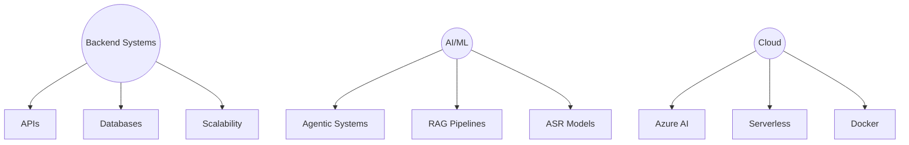

<!-- Futuristic Profile Banner -->

  

---

## 👨‍🚀 Mission Log

> *"Engineering the space of Backend and Artificial Intelligence, and turning abstract systems into realities."*

- 🌌 Exploring **Agentic AI Systems** & **RAG Architectures**
- ⚡ Designing **scalable backends** with Flask, FastAPI & serverless Azure Functions
- 🛰️ Automating **Geospatial AI** with Google Earth Engine & LLMs
- 🧪 Experimenting with **model validation, fine-tuning, and vector databases**

---

## 🧩 Tech Constellation

| Domain | Tools & Frameworks |
|--------|--------------------|
| **AI/ML** | PyTorch · HuggingFace · LangChain · LangGraph · Transformers · Wav2Vec2 · LLMs (Llama3, Qwen) |
| **Backend** | Flask · FastAPI · REST APIs · PostgreSQL · MySQL · Pydantic |
| **Cloud/DevOps** | Azure AI (Search, Storage, Function Apps) · Docker · Git · Postman |
| **Geospatial** | Google Earth Engine · PostGIS |
| **Languages** | Python · C++ · C |

---

## 📡 Signal Boost (Experience)

**🔵 AI Intern @ Siemens DISW (2025 – Present)**  
Building scalable **agentic pipelines on Azure AI**, integrating RAG + serverless backends.

**🛰️ Project Intern @ ISRO (2024–25)**  
Developed REST APIs combining **LLMs + Earth Observation Data** for geospatial automation.

---

## 🚀 Launchpad Projects

### 🧑‍💼 Organisational-Agents
> AI-powered productivity agents orchestrating Notion & email workflows.  
🔗 [View Project](https://github.com/nio2004/Organizational-Agents)

### 🗣 Marathi ASR
> Speech-to-text pipeline fine-tuned on Wav2Vec2-BERT, deployed to Hugging Face Hub.  
🤗 [View Model](https://huggingface.co/hriteshMaikap/marathi-asr-model)

## 🏆 Milestones Unlocked

- 🥇 **ISRO Bhartiya Antariksh Hackathon** – Winner
- 🥈 **Citi Campus Innovation Challenge 5.0** – Top 5 Finalist (out of 1743 teams)
- 🏅 **Multiple Hackathon Wins** in AI/ML & Generative AI
- 📄 **Research Publications** in Springer & Scopus (Flood Prediction, Healthcare AI)

---

## 📊 Telemetry Dashboard

  
  

---

## 🧭 Current Navigation

---

## 🌐 Connect with Me

  
  
  
  

  

