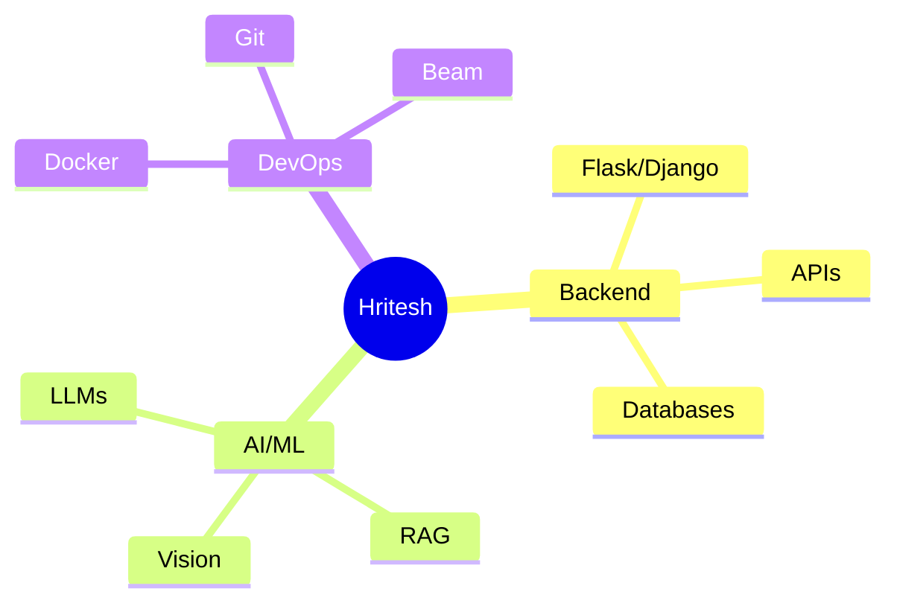

<h1 align="center">Hi there! I'm Hritesh Maikap 👋</h1>
<h3 align="center">A Backend Developer & AI Explorer 🚀 | Building the Future with Code</h3>

<div align="center">
  <a href="https://www.linkedin.com/in/hritesh-maikap-7aaa76246">
    
  </a>
  <a href="https://twitter.com/hriteshmaikap">
    
  </a>
  <a href="mailto:hriteshkumarmaikap@gmail.com">
    
  </a>
  <a href="https://kaggle.com/hriteshmaikap">
    
  </a>
</div>

---

## 🚀 About Me

```python
class HriteshMaikap:
    def __init__(self):
        self.role = "Software Developer & AI Enthusiast"
        self.education = "B.Tech in AI & Data Science @ VIT Pune"
        self.work = "ex-Project Intern @ ISRO"
        self.interests = ["Backend Development", "Machine Learning", "LLMs"]
        
    def say_hi(self):
        print("Thanks for dropping by! Let's build something amazing together! 🚀")
```

---

## 🛠️ Tech Stack
<div align="center">
  
</div>

---

## 💼 What I'm Working On

- 🔭 Currently working on **RAG Based Chatbot for Ancient Indian Scriptures**
- 🌱 Learning **Backend Development, Advanced LLM Architectures and AI Based Projects**
- 👯 Looking to collaborate on **ML and Backend based projects**
- 💬 Ask me about **Python, Machine Learning, Backend Development**

---

## 🏆 Achievements & Projects

### 🌟 ISRO BAH PS-12 Winner (Top 5)
- Built a Geospatial Context-Aware Chatbot using RAG architecture
- Reduced query time by 50% using optimized vector search
- Tech: Django, PostGIS, BERT, Langchain, Groq, Mixtral

### 🤖 INSPIR: Image Captioning System
- Multi-model approach using CLIP, BLIP, GIT, ViT-GPT2
- Implemented advanced ranking system for caption quality
- Integrated with Apache Beam for scalable processing

---

## 📊 GitHub Stats

<div align="center">
  
  
</div>

---

## 🎯 Current Focus



---

## 🌟 Featured Repositories

<div align="center">
  <a href="https://github.com/IEEE-SB-VIT-Pune/ieeeChat">
    
  </a>
  <a href="https://github.com/hriteshmaikap/inspir">
    
  </a>
</div>

---

## 📫 Let's Connect!

<div align="center">
  <p>💡 Open for collaborations and interesting projects!</p>
  <p>🌟 Let's build something amazing together!</p>
</div>

<div align="center">
  
</div>

---
